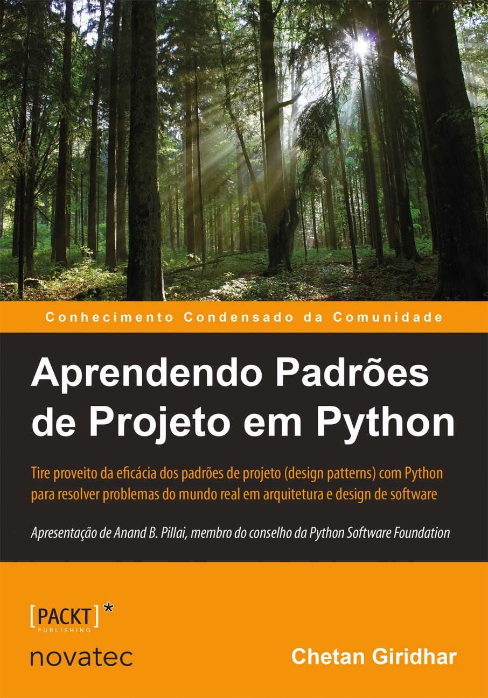

# book-design_patterns

Design pattern studies from the book "Aprendendo Padrões de Projeto em Python" by Chetan Giridhar (Novatec).
Copyright 2016 from Novatec Editora Ltda.

ISBN: 978-85-7522-523-3

The site to buy the book: [Amazon](https://www.amazon.com.br/Aprendendo-Padr%C3%B5es-Projeto-Python-arquitetura-ebook/dp/B08749G2KV/ref=sr_1_3?keywords=padroes+de+projeto&qid=1682465181&sprefix=padroes+de+projeto%2Caps%2C328&sr=8-3)

All codes were based on the cited book.

## Contents

1. Introdução aos padrões de projeto
2. Padrão de projeto Singleton
3. Padrão Factory – construindo fábricas para criar objetos
4. Padrão Façade – sendo adaptável com o Façade
5. Padrão Proxy – controlando o acesso a objetos
6. Padrão Observer – de olho nos objetos
7. Padrão Command – encapsulando chamadas
8. Padrão Template Method – encapsulando algoritmos
9. Modelo-Visão-Controlador – padrões compostos
10. Padrão de projeto State
11. Antipadrões

## Others

See also the repository [course-python](https://github.com/thiagoneye/course-python) e [book-oop](https://github.com/thiagoneye/book-oop).

